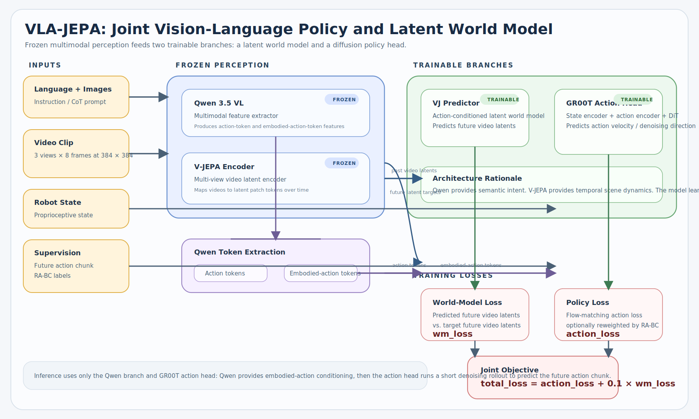

<h3 align="center" style="font-size:48px; font-weight:bold; color:#9C276A; margin: 0;">
  VLA-JEPA (YonduAI)
</h3>

<p align="center">
  <em>A production-oriented Vision–Language–Action model with a frozen V-JEPA latent world model, frozen Qwen 3.5 VL conditioning, a trainable V-JEPA predictor, and a flow-matching DiT action head.</em>
</p>

<div align="center">
<p>
  
  
  
  
  
</p>
</div>

<div align="center">
  
</div>

<a id="table-of-contents"></a>
## Table of Contents
- [Overview](#overview)
- [Architecture](#architecture)
- [Repository Layout](#repository-layout)
- [⚙️ Environment Setup](#environment-setup)
- [📁 Data Preparation](#data-preparation)
  - [Canonical GCS dataset](#canonical-gcs-dataset)
  - [LeRobot subtask data](#lerobot-subtask-data)
  - [Preprocessed subtask data](#preprocessed-subtask-data)
- [🔥 Training](#training)
  - [Active configs](#active-configs)
  - [Launcher scripts](#launcher-scripts)
  - [Single-GPU runbook](#single-gpu-runbook)
  - [Multi-GPU runbook (A100×4 / A100×8)](#multi-gpu-runbook)
  - [Optimizer and loss composition](#optimizer-and-loss-composition)
- [🧪 Auxiliary Objectives](#auxiliary-objectives)
  - [V-JEPA latent world-model loss](#vj-loss)
  - [MoGe geometry teacher (depth/normal feature distillation)](#moge-loss)
  - [RA-BC: progress-aware action weighting](#rabc)
  - [RTC: real-time control prefix training](#rtc)
- [💾 Checkpoints, Resume, and Logging](#checkpoints-resume-and-logging)
- [📊 Evaluation](#evaluation)
- [🚀 Deployment](#deployment)
- [🧰 Utilities and Tests](#utilities-and-tests)
- [📚 Docs Index](#docs-index)
- [Notes and Caveats](#notes-and-caveats)
- [🤝 Acknowledgements](#acknowledgements)

<a id="overview"></a>
## Overview

This repository is the YonduAI fork of `ginwind/VLA-JEPA`. The headline method is preserved — a Vision–Language–Action model with a latent video world model on top of frozen perceptual backbones — but the training pipeline, dataloaders, configs, deployment surface, and auxiliary objectives have all been substantively rewritten for production training.

The active research and training surface includes:

- A primary `VLA_JEPA` framework that orchestrates Qwen 3.5 VL, V-JEPA 2.1, the V-JEPA predictor, and a GR00T-style flow-matching DiT action head.
- A canonical robotics dataset path that streams pre-canonicalized shards from GCS with shard-aware shuffling, lazy window indexing, and per-rank metadata prefetch.
- Two additional dataset paths: a LeRobot v2.1 path (Trossen / DROID / BridgeV2 / etc.) and a preprocessed-subtask path with pre-tokenized Qwen inputs.
- A MoGe-2 monocular geometry teacher applied as feature-level distillation onto Qwen image tokens.
- RA-BC (progress-aware) action loss weighting and RTC (real-time control) prefix training for the action head.
- An `Accelerate`-managed trainer with optional DeepSpeed ZeRO-2/3, full-state checkpointing, and rank-safe save/eval semantics.
- Hardened model-serving code in [`deployment/model_server/`](./deployment/model_server) for policy inference.

For background on the architectural changes vs. upstream see [`docs/yonduai_fork_changes.md`](./docs/yonduai_fork_changes.md). For a diagrammatic walkthrough of the training and inference paths see [`docs/vla_jepa_architecture.md`](./docs/vla_jepa_architecture.md) and [`assets/vla_jepa_architecture_research.svg`](./assets/vla_jepa_architecture_research.svg).

<a id="architecture"></a>
## Architecture

The active training path lives in [`starVLA/model/framework/VLA_JEPA.py`](./starVLA/model/framework/VLA_JEPA.py). It composes four components with explicit freeze/train semantics:

| Component | Module | Default state |
| --- | --- | --- |
| Qwen 3.5 VL multimodal backbone | [`starVLA/model/modules/vlm/QWen3_5.py`](./starVLA/model/modules/vlm/QWen3_5.py) | Frozen on single-GPU configs; fully trainable on the canonical A100×8 profile (LoRA optional) |
| V-JEPA 2.1 video encoder | [`starVLA/model/modules/world_model/`](./starVLA/model/modules/world_model) (loaded from torchhub) | Frozen |
| V-JEPA predictor (latent world model) | [`starVLA/model/modules/world_model/vj2_predictor.py`](./starVLA/model/modules/world_model/vj2_predictor.py) | Trainable |
| DiT-B flow-matching action head | [`starVLA/model/modules/action_model/GR00T_ActionHeader.py`](./starVLA/model/modules/action_model/GR00T_ActionHeader.py) | Trainable |
| MoGe-2 geometry teacher (optional aux) | [`starVLA/model/modules/geometry_teacher.py`](./starVLA/model/modules/geometry_teacher.py) | Frozen teacher + trainable projection head |

Per-batch the model receives `B × V × T × C × H × W` videos (default `V=3`, `T=8`, `H=W=384`), a Qwen prompt assembled from the same views' final frame plus the language instruction, the current robot state, the future action chunk target, and RA-BC progress metadata.

Loss composition (see [`starVLA/training/train_starvla.py`](./starVLA/training/train_starvla.py)):

```text
total_loss = action_loss_scale * action_loss
           + wm_loss_scale     * wm_loss            # warmup-scheduled
           + depth_teacher_loss_scale * depth_teacher_loss   # if enabled
```

- `action_loss` — per-sample flow-matching loss from the DiT head, optionally reweighted by RA-BC progress.
- `wm_loss` — L1 between predicted future V-JEPA latent states and the ground-truth latents of the future window.
- `depth_teacher_loss` — pooled L1 + similarity loss between Qwen image-token features and frozen MoGe-2 features.

Inference is deliberately narrow: only Qwen + the action head run. The action chunk is denoised in `num_inference_timesteps = 4` Euler steps from Gaussian noise.

<a id="repository-layout"></a>
## Repository Layout

```text
VLA-JEPA/
├── starVLA/                    # Library
│   ├── training/
│   │   ├── train_starvla.py    # Main trainer (Accelerate + optional DeepSpeed)
│   │   └── trainer_utils/      # Distributed-safe rank/barrier helpers
│   ├── model/
│   │   ├── framework/
│   │   │   ├── VLA_JEPA.py     # Active framework
│   │   │   └── …               # QwenGR00T / QwenDual / QwenFast / M1 / … (legacy)
│   │   └── modules/
│   │       ├── vlm/            # Qwen 2.5 / 3 / 3.5 wrappers
│   │       ├── world_model/    # V-JEPA encoder + predictor
│   │       ├── action_model/   # DiT, flow-matching head, RTC, GR00T
│   │       ├── projector/      # QFormer (legacy)
│   │       └── geometry_teacher.py  # MoGe-2 distillation
│   ├── dataloader/
│   │   ├── canonical_subset_dataset.py      # GCS canonical pipeline
│   │   ├── preprocessed_subtask_dataset.py  # Pre-tokenized subtask path (YonduAI-added)
│   │   ├── lerobot_datasets.py              # LeRobot v2.1 wrapper
│   │   └── gr00t_lerobot/                   # Per-robot data configs and mixtures
│   └── config/deepseeds/       # DeepSpeed ZeRO-2 / ZeRO-3 launch configs
├── scripts/
│   ├── config/                 # Per-run YAMLs (5090, A100×4, A100×8, smoke, LoRA)
│   ├── lib/training_env.sh     # Shared launcher helpers (NICs, sidecar cleanup, …)
│   ├── vlajepa_robot_ft_*.sh   # Per-config launchers
│   ├── benchmark_*.sh          # A100×8 throughput sweeps
│   ├── prefill_canonical_gcs_cache.py
│   ├── sweep_training_dataloader.py
│   ├── watch_and_upload_checkpoints_gcs.sh
│   └── tb.sh                   # TensorBoard launcher
├── deployment/model_server/    # Policy inference server (HTTP + websocket)
├── examples/                   # LIBERO / LIBERO-Plus / SimplerEnv / Droid eval
├── docs/                       # Architecture, fork notes, depth teacher, env setup
├── tests/                      # Trainer, RTC, geometry teacher, PyAV, action chunking
└── playground/                 # GPU decode frame-index precomputation
```

<a id="environment-setup"></a>
## ⚙️ Environment Setup

The recommended fresh-machine path is now the no-compile Python 3.13 setup. It installs the latest PyPI PyTorch/torchvision pair first, then the small runtime package set in [`requirements-py313-min.txt`](./requirements-py313-min.txt). Full setup notes, optional accelerators, and legacy CUDA 12.4 instructions live in [`docs/repo_environment_setup.md`](./docs/repo_environment_setup.md).

```bash
cd /path/to/VLA-JEPA
./scripts/setup_py313_min_env.sh
conda activate vla-jepa-py313-min
export PYTHONNOUSERSITE=1
```

If you prefer a hand-rolled environment:

```bash
conda create -n vla-jepa-py313-min python=3.13 -y
conda activate vla-jepa-py313-min
export PYTHONNOUSERSITE=1
pip install --upgrade pip "setuptools<82" wheel
pip install --upgrade torch torchvision
pip install --upgrade -r requirements-py313-min.txt
pip install -e .
```

This path was smoke-tested on Python 3.13.13 with `torch==2.11.0+cu130` / `torchvision==0.26.0+cu130` on an RTX 5090. It also passed the repo `tests/` suite. FlashAttention, DeepSpeed, bitsandbytes, Decord, MoGe, torchcodec, and wandb are intentionally optional installs instead of default setup blockers. For Trossen/LeRobot training in this env, set `datasets.vla_data.video_backend: pyav`; Decord can still be installed explicitly for older Python stacks or a locally built wheel.

<a id="data-preparation"></a>
## 📁 Data Preparation

The trainer dispatches between three dataset implementations via `datasets.vla_data.dataset_py`. Pick the one that matches your data layout.

<a id="canonical-gcs-dataset"></a>
### Canonical GCS dataset

`dataset_py: canonical_subset_vla` → [`starVLA/dataloader/canonical_subset_dataset.py`](./starVLA/dataloader/canonical_subset_dataset.py)

The production training path. Reads pre-canonicalized robotics shards directly from `gs://robotics-datasets-yonduai/raw`, joining them through manifests + per-dataset adapters from a sibling `dataset-canonicalization/` repo. Key behaviors:

- Lazy shard indexing (`lazy_cache_shards`, `index_windows_lazily`) so startup does not materialize every stride window.
- Per-rank metadata prefetch (`prefetch_metadata_across_ranks: true`).
- Shard-level shuffling with a fixed `shuffle_seed`.
- Sidecar `q01/q99` action/state normalization in `float16`.
- PyAV video decode with thread/cache controls (`pyav_thread_count`, `pyav_thread_type`, `pyav_reader_cache_size`) and a bounded on-disk video cache (`video_cache_max_gb`).

Use [`scripts/prefill_canonical_gcs_cache.py`](./scripts/prefill_canonical_gcs_cache.py) to warm the local video cache before a long run, and [`scripts/diagnose_canonical_dataset_decode.py`](./scripts/diagnose_canonical_dataset_decode.py) to debug decode failures.

<a id="lerobot-subtask-data"></a>
### LeRobot subtask data

`dataset_py: lerobot_datasets` → [`starVLA/dataloader/lerobot_datasets.py`](./starVLA/dataloader/lerobot_datasets.py)

The LeRobot v2.1 path. Robot-specific configs live in [`starVLA/dataloader/gr00t_lerobot/data_config.py`](./starVLA/dataloader/gr00t_lerobot/data_config.py); named mixtures live in [`starVLA/dataloader/gr00t_lerobot/mixtures.py`](./starVLA/dataloader/gr00t_lerobot/mixtures.py). Trossen, DROID, BridgeV2, Fractal, and LIBERO are wired up; YonduAI also adds `TrossenAIStationaryDataConfig` and the `trossen_subtask_combined` mixture.

To use a custom LeRobot dataset:

1. Convert it to LeRobot v2.1.
2. Drop a `modality.json` under `meta/` (templates in [`examples/`](./examples)).
3. Add a config class in `data_config.py` with the matching `video_keys` / `state_keys` / `action_keys`, and register it in `ROBOT_TYPE_CONFIG_MAP`.
4. Add a mixture entry in `mixtures.py` and reference it from `datasets.vla_data.data_mix` in your YAML.

The video backend has been switched from `torchvision_av` to `decord` for this path.

<a id="preprocessed-subtask-data"></a>
### Preprocessed subtask data

`dataset_py: preprocessed_subtask_dataset` → [`starVLA/dataloader/preprocessed_subtask_dataset.py`](./starVLA/dataloader/preprocessed_subtask_dataset.py)

A YonduAI-added path that reads episode-level preprocessed folders, pulls action/state/task/mistake/complexity labels, derives RA-BC progress fields, and uses a worker-side `PreprocessedSubtaskCollator` that lazily builds Qwen processor inputs and injects the action-token spans. It also exposes a bounded JPEG frame cache via `frame_cache_size` and clamps DataLoader workers via `safe_num_workers_cap` so the heavy decode path does not blow worker memory.

<a id="training"></a>
## 🔥 Training

### Pretrained checkpoints

Before training, materialize the two backbones you reference in the config:

- Qwen 3.5 VL (`Qwen/Qwen3.5-0.8B`) — set via `framework.qwenvl.base_vlm`.
- V-JEPA 2.1 (`vjepa2_1_vit_base_384`) — pulled via torchhub from `framework.vj2_model.hub_repo_or_dir` with checkpoint key `ema_encoder` from `vjepa2_1_vitb_dist_vitG_384.pt`.

If `framework.depth_teacher_aux.enabled: true`, the trainer additionally loads `Ruicheng/moge-2-vits-normal` (or `…-vitl-normal`) from the path at `framework.depth_teacher_aux.moge_repo_path`.

<a id="active-configs"></a>
### Active configs

All YAMLs live under [`scripts/config/`](./scripts/config). The currently relevant ones:

| Profile | Config | Purpose |
| --- | --- | --- |
| **Single-GPU dev (RTX 5090)** | [`vlajepa_robot_ft_trossen_vjepa21_small_5090_lerobot.yaml`](./scripts/config/vlajepa_robot_ft_trossen_vjepa21_small_5090_lerobot.yaml) | Trossen LeRobot subtask data, Qwen frozen, RA-BC on, `repeated_diffusion_steps=2`, `compile_*=true` |
| Single-GPU LoRA | [`vlajepa_robot_ft_trossen_vjepa21_small_5090_lerobot_lora.yaml`](./scripts/config/vlajepa_robot_ft_trossen_vjepa21_small_5090_lerobot_lora.yaml) | LoRA adapter on Qwen instead of full freeze |
| **Canonical GCS, A100×8 production** | [`vlajepa_robot_ft_canonical_full_a100x8_qwen_full_zero3_moge_vits.yaml`](./scripts/config/vlajepa_robot_ft_canonical_full_a100x8_qwen_full_zero3_moge_vits.yaml) | Full Qwen fine-tune under DeepSpeed ZeRO-2-stable, MoGe-2 ViT-S teacher on, RTC enabled, `per_device_batch_size=26` (×8 = 208) |
| Canonical multi-subset pilot | [`vlajepa_robot_ft_canonical_multi_subset_a100x8_moge_vjteacher_pilot.yaml`](./scripts/config/vlajepa_robot_ft_canonical_multi_subset_a100x8_moge_vjteacher_pilot.yaml) | Smaller canonical subset for pilot runs |
| A100×4 lerobot | [`vlajepa_robot_ft_trossen_vjepa21_small_a100x4.yaml`](./scripts/config/vlajepa_robot_ft_trossen_vjepa21_small_a100x4.yaml) | Mid-scale Trossen LeRobot |
| Smoke tests | [`vlajepa_robot_ft_canonical_subset_5090_smoke.yaml`](./scripts/config/vlajepa_robot_ft_canonical_subset_5090_smoke.yaml), [`vlajepa_robot_ft_canonical_multi_subset_a100x8_smoke.yaml`](./scripts/config/vlajepa_robot_ft_canonical_multi_subset_a100x8_smoke.yaml), [`vlajepa_robot_ft_canonical_multi_subset_5090_smoke.yaml`](./scripts/config/vlajepa_robot_ft_canonical_multi_subset_5090_smoke.yaml) | Reduced step / shard counts for plumbing checks |

DeepSpeed launch configs sit in [`starVLA/config/deepseeds/`](./starVLA/config/deepseeds): `deepspeed_zero2_stable.yaml` is the production default; ZeRO-3 is wired but reserved for memory-constrained sweeps.

<a id="launcher-scripts"></a>
### Launcher scripts

Each YAML has a matching shell launcher in [`scripts/`](./scripts). Launchers source [`scripts/lib/training_env.sh`](./scripts/lib/training_env.sh) which handles NIC selection, NCCL/UCX env, sidecar-file cleanup on exit, and HuggingFace cache routing.

The most relevant entry points:

```text
scripts/vlajepa_robot_ft_trossen_5090_lerobot.sh
scripts/vlajepa_robot_ft_trossen_a100x4.sh
scripts/vlajepa_robot_ft_canonical_full_a100x8_qwen_full_zero3_moge_vits.sh
scripts/vlajepa_robot_ft_canonical_multi_subset_a100x8_moge_vjteacher_pilot.sh
scripts/vlajepa_robot_ft_canonical_multi_subset_a100x8_smoke.sh
scripts/vlajepa_robot_ft_canonical_subset_5090_smoke.sh
```

All of them ultimately exec `accelerate launch ./starVLA/training/train_starvla.py --config_yaml <yaml> [--<dotted.key> value …]`. Any value in the YAML can be overridden on the CLI by its dotted path (e.g. `--trainer.learning_rate.action_model 5e-5`).

<a id="single-gpu-runbook"></a>
### Single-GPU runbook

```bash
cd /path/to/VLA-JEPA
./scripts/vlajepa_robot_ft_trossen_5090_lerobot.sh
```

The launcher defaults to fused `AdamW`. To use a lower-memory optimizer:

```bash
OPTIMIZER_NAME=AdamW8bit ./scripts/vlajepa_robot_ft_trossen_5090_lerobot.sh
```

Common single-GPU env knobs honored by the launcher:

```bash
RUN_ID=...                            # override checkpoint dir name
COMPILE_FULL_MODEL=true               # enable full-graph torch.compile
SAVE_BEST_ONLY=true                   # only keep best checkpoint by mae_score
GPU_VIDEO_DECODE_ON_RANK=true         # rank-local GPU video decode
RUNTIME_TIMING_LOGGING=false          # quiet the dataloader timing prints
```

<a id="multi-gpu-runbook"></a>
### Multi-GPU runbook (A100×4 / A100×8)

For the canonical full A100×8 profile:

```bash
cd /path/to/VLA-JEPA
./scripts/vlajepa_robot_ft_canonical_full_a100x8_qwen_full_zero3_moge_vits.sh
```

This launcher sets `STARVLA_DEEPSPEED_STAGE=2` and points `ACCELERATE_CONFIG` at [`starVLA/config/deepseeds/deepspeed_zero2_stable.yaml`](./starVLA/config/deepseeds/deepspeed_zero2_stable.yaml). DeepSpeed activation is gated by `STARVLA_USE_DEEPSPEED` (or `ACCELERATE_USE_DEEPSPEED` / `ACCELERATE_DISTRIBUTED_TYPE=DEEPSPEED`). `torch.compile` is disabled by default for this profile via `TORCH_COMPILE_DISABLE=1`; set `STARVLA_ALLOW_TORCH_COMPILE=1` to opt back in.

Useful runtime overrides exposed as env vars by the canonical launcher:

```bash
PER_DEVICE_BATCH_SIZE=26
DATALOADER_NUM_WORKERS=4
PYAV_THREAD_COUNT=1
PYAV_READER_CACHE_SIZE=8
VIDEO_CACHE_MAX_GB=500
RTC_PROB=1.0
RTC_WARMUP_STEPS=100000
RTC_RAMP_STEPS=500000
SAVE_INTERVAL=10000
EVAL_INTERVAL=10000
EXCLUDE_DATASET_IDS_PATH=/path/to/exclude.txt   # filter manifest entries
```

<a id="optimizer-and-loss-composition"></a>
### Optimizer and loss composition

Optimizer and scheduler are configured under `trainer.optimizer.*` and `trainer.lr_scheduler_type` (canonically `cosine_with_min_lr`). Per-module learning rates can be set independently:

```yaml
trainer:
  learning_rate:
    base: 2.0e-5
    qwen_vl_interface: 1.0e-5
    action_model: 1.0e-4
```

Loss scales (with optional warmup on the world-model term):

```yaml
trainer:
  loss_scale:
    action: 1.0
    wm: 0.1
    wm_initial: 0.3            # start of wm warmup
    wm_warmup_steps: 2000      # linear ramp wm_initial -> wm
    depth_teacher: 0.004
```

Other trainer flags worth knowing:

- `trainer.repeated_diffusion_steps` — repeats the action target N times along the batch for cheap diffusion-step augmentation. Defaults to `1` on the canonical config and `2` on the 5090 config.
- `trainer.gradient_accumulation_steps` — synchronizes optimizer/scheduler/zero_grad at the right microstep boundary.
- `trainer.enable_gradient_checkpointing` — on by default.
- `trainer.channels_last` — applies channels-last to image and video tensors.
- `trainer.compile_*` — independent toggles for Qwen, action head, predictor, encoder, and full graph.
- `trainer.find_unused_parameters` — kept on because the depth-teacher and wm branches can be inactive on some steps.

The trainer resolves `trainer.max_train_steps`, `trainer.num_warmup_steps`, `trainer.save_interval`, and `trainer.eval_interval` automatically from epoch-derived counts when set to `auto` or to a number ≤ epoch length.

<a id="auxiliary-objectives"></a>
## 🧪 Auxiliary Objectives

<a id="vj-loss"></a>
### V-JEPA latent world-model loss

For each batch the V-JEPA encoder emits latent tokens for both past and future windows. Past-context latents plus action-token conditioning from Qwen are fed into the V-JEPA predictor; the predicted future latents are L1-matched against the ground-truth future latents. The encoder is wrapped in `no_grad` independently of Qwen's freeze state so the predictor receives gradients regardless of Qwen LoRA / freeze settings. The predictor has a corrected RoPE implementation; pass `framework.vj2_model.use_legacy_rope_bug: true` to reproduce the legacy interleave behavior of older checkpoints.

<a id="moge-loss"></a>
### MoGe geometry teacher (depth/normal feature distillation)

Inspired by LingBot-VLA's query depth alignment, this is feature-embedding distillation rather than depth/normal regression. A trainable [`QueryGeometryTeacherHead`](./starVLA/model/modules/geometry_teacher.py) consumes Qwen image hidden states plus dedicated `<|geometry_i|>` prompt tokens and predicts 256 frozen MoGe-2 feature tokens per view with a SmoothL1 target. The branch is gated by `framework.depth_teacher_aux.enabled` and is off by default. See [`docs/depth_teacher_aux.md`](./docs/depth_teacher_aux.md) for the full design rationale and token-alignment invariants.

<a id="rabc"></a>
### RA-BC: progress-aware action weighting

When `trainer.use_rabc: true`, per-sample action loss is multiplied by a function of `rabc_progress_delta` (with `rabc_global_progress_delta` as a fallback) controlled by `rabc_kappa` and `rabc_epsilon`. Samples flagged as mistakes are reweighted by `rabc_mistake_weight`; the trainer warns if mistake samples are configured to contribute zero loss. RA-BC progress fields are populated by both the LeRobot path and the preprocessed subtask path.

<a id="rtc"></a>
### RTC: real-time control prefix training

`framework.action_model.rtc_training` enables prefix-conditioned training for real-time control. A clean prefix of length sampled from the configured distribution conditions the DiT, and `rtc_prob` ramps from 0 → 1 over `warmup_steps` + `ramp_steps`. The implementation lives in [`starVLA/model/modules/action_model/rtc_training.py`](./starVLA/model/modules/action_model/rtc_training.py); see [`tests/test_rtc_training.py`](./tests/test_rtc_training.py) for behavior tests.

<a id="checkpoints-resume-and-logging"></a>
## 💾 Checkpoints, Resume, and Logging

The trainer writes full `Accelerate` state directories so any saved checkpoint can be resumed by the same script and config:

```text
checkpoints/<run_id>/checkpoints/steps_<N>/
```

Resume by setting `trainer.is_resume: true` plus `trainer.resume_step` (or `resume_epoch`) in the YAML, or by passing them as CLI overrides. `trainer.checkpoint_max_to_keep` rotates older snapshots; `trainer.save_best_only` plus `trainer.best_metric_name` (default `mae_score`, mode `min`) keeps only improving checkpoints.

Logging:

- TensorBoard tracker is enabled via `trackers: [tensorboard]` and runs through `Accelerator.log()` (no parallel manual writer).
- Per-step logs include per-parameter-group `lr_*` instead of a single top-level `learning_rate`.
- Step 0 metric noise is suppressed.
- Peak CUDA memory is reset after each logging window so peak metrics remain meaningful.

Quick TensorBoard viewer:

```bash
./scripts/tb.sh   # or:
tensorboard --logdir checkpoints/<run_id> --port 6006
```

GCS-backed runs can use [`scripts/watch_and_upload_checkpoints_gcs.sh`](./scripts/watch_and_upload_checkpoints_gcs.sh) to mirror new checkpoints into a bucket as they appear, and [`scripts/watch_training_until_step.py`](./scripts/watch_training_until_step.py) to gate further automation on training progress.

<a id="evaluation"></a>
## 📊 Evaluation

Evaluation harnesses live in [`examples/`](./examples), each in its own conda environment because the simulators have conflicting deps:

- **LIBERO** — [`examples/LIBERO/`](./examples/LIBERO). Edit `examples/LIBERO/eval_libero.sh` to set `LIBERO_HOME`, `sim_python`, and `your_ckpt`. Runs the four task suites in parallel across 4 GPUs.
- **LIBERO-Plus** — [`examples/LIBERO-Plus/`](./examples/LIBERO-Plus). Use the provided `libero_plus_init.py` as the LIBERO-Plus benchmark `__init__.py`. Runs seven perturbation dimensions in parallel.
- **SimplerEnv** — [`examples/SimplerEnv/`](./examples/SimplerEnv). Run `eval_files/auto_eval_scripts/batch_evaluate.sh` then compute success with `calc_success_rate.sh <task_suite> <model_path> <log_dir>`. Suites: `pick_coke_can | move_near | drawer | long_horizon_apple_in_drawer | bridge_put_on`.
- **Droid** — [`examples/Droid/`](./examples/Droid). Real-robot demo materials.

For each suite, the checkpoint's `config.yaml` must point `framework.qwenvl.base_vlm` and `framework.vj2_model.base_encoder` (or `hub_repo_or_dir`) at locally available paths.

<a id="deployment"></a>
## 🚀 Deployment

[`deployment/model_server/`](./deployment/model_server) hosts the policy inference server. Highlights of the hardening pass on this fork:

- `--cuda` is parsed as an int with clean CPU fallback when CUDA is unavailable.
- bf16 is enabled only when CUDA is actually present.
- All `print()` debug paths replaced with structured logging.
- The websocket server validates incoming payloads (must be a dict, must include `batch_images`), returns msgpack-packed structured errors instead of raw tracebacks, and avoids mutating the caller's payload.

See [`deployment/readme-deployment.md`](./deployment/readme-deployment.md) for the operator runbook.

<a id="utilities-and-tests"></a>
## 🧰 Utilities and Tests

| File | Purpose |
| --- | --- |
| [`scripts/setup_repo_env.sh`](./scripts/setup_repo_env.sh) | One-command scratch-mount conda env bootstrap |
| [`scripts/build_decord_gpu.sh`](./scripts/build_decord_gpu.sh) | Builds GPU-enabled `decord` for canonical/lerobot decode paths |
| [`scripts/prefill_canonical_gcs_cache.py`](./scripts/prefill_canonical_gcs_cache.py) | Warms the local video cache before a long canonical run |
| [`scripts/diagnose_canonical_dataset_decode.py`](./scripts/diagnose_canonical_dataset_decode.py) | Reproduces decode failures on a single shard |
| [`scripts/sweep_training_dataloader.py`](./scripts/sweep_training_dataloader.py) | Throughput sweep over worker / cache / decode settings |
| [`scripts/check_dataset.py`](./scripts/check_dataset.py) | Quick dataset sanity check |
| [`scripts/benchmark_full_qwen_a100x8_*.sh`](./scripts) | DeepSpeed throughput benchmarks (matrix, targeted, ZeRO-2 tuning, follow-up) |
| [`scripts/watch_and_upload_checkpoints_gcs.sh`](./scripts/watch_and_upload_checkpoints_gcs.sh) | Mirror checkpoints to GCS as they land |
| [`playground/precompute_gpu_decode_frame_indices.py`](./playground/precompute_gpu_decode_frame_indices.py) | Precompute decode plans for the GPU decode worker |

Tests under [`tests/`](./tests):

- [`test_geometry_teacher.py`](./tests/test_geometry_teacher.py) — MoGe distillation invariants.
- [`test_rtc_training.py`](./tests/test_rtc_training.py) — RTC prefix sampling and ramp.
- [`test_training_action_chunking.py`](./tests/test_training_action_chunking.py) — action chunk shape contracts.
- [`test_canonical_pyav_threads.py`](./tests/test_canonical_pyav_threads.py) — canonical decode threading config.
- [`test_train_starvla_deepspeed_guard.py`](./tests/test_train_starvla_deepspeed_guard.py) — DeepSpeed activation guard.

<a id="docs-index"></a>
## 📚 Docs Index

- [`docs/vla_jepa_architecture.md`](./docs/vla_jepa_architecture.md) — training/inference diagrams, freeze-train status, tensor shapes.
- [`docs/yonduai_fork_changes.md`](./docs/yonduai_fork_changes.md) — fork-vs-upstream change inventory.
- [`docs/depth_teacher_aux.md`](./docs/depth_teacher_aux.md) — MoGe-2 feature-distillation design.
- [`docs/repo_environment_setup.md`](./docs/repo_environment_setup.md) — production environment runbook.

<a id="notes-and-caveats"></a>
## Notes and Caveats

- Single-GPU (5090) and A100×4/×8 paths are exercised regularly; verify multi-node setups on real hardware before treating them as certified.
- The framework variants other than `VLA_JEPA` (`M1`, `QwenDual`, `QwenFast`, `QwenGR00T`, `QwenOFT`, `QwenPI`) are kept in the tree as legacy reference implementations and are not part of the active training surface.
- `lerobot_datasets` defaults to `decord` as the video backend but can be set to `pyav` with `datasets.vla_data.video_backend`; `canonical_subset_dataset` uses PyAV; `preprocessed_subtask_dataset` decodes JPEGs directly. If you switch dataset paths, reconfirm the decode environment.
- Mixed precision is handled via manual `bfloat16` autocast within the framework rather than `Accelerate`-AMP; `trainer.mixed_precision: no` is intentional.
- `find_unused_parameters: true` is required because the wm and depth-teacher branches can be inactive on some steps.

<a id="acknowledgements"></a>
## 🤝 Acknowledgements

This repository builds on [VLA-JEPA](https://github.com/ginwind/VLA-JEPA), [starVLA](https://github.com/starVLA/starVLA), [V-JEPA 2](https://github.com/facebookresearch/vjepa2), [GR00T](https://github.com/NVIDIA/Isaac-GR00T), and [MoGe](https://github.com/microsoft/MoGe). We gratefully acknowledge their open-source contributions.

If your work refers to the original VLA-JEPA method, please cite the upstream paper:

```bibtex
@misc{vlajepa2026,
    title  = {VLA-JEPA: Enhancing Vision-Language-Action Model with Latent World Model},
    author = {Jingwen Sun and Wenyao Zhang and Zekun Qi and Shaojie Ren and Zezhi Liu and Hanxin Zhu and Guangzhong Sun and Xin Jin and Zhibo Chen},
    year   = {2026},
    eprint = {2602.10098},
    archivePrefix = {arXiv},
    primaryClass = {cs.RO},
    url = {https://arxiv.org/abs/2602.10098}
}
```
