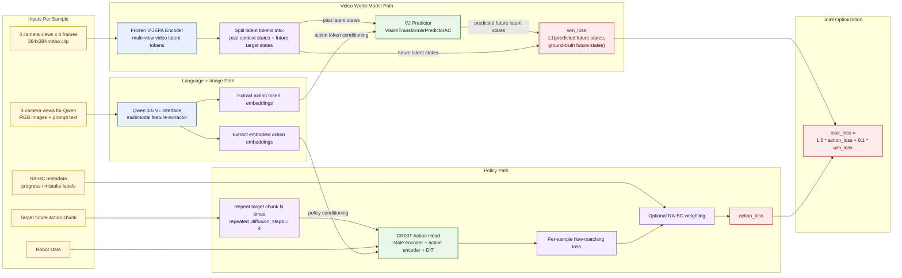
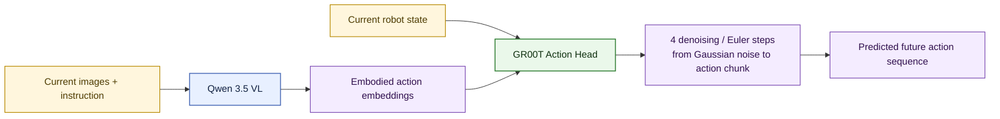

# VLA-JEPA Architecture

This diagram reflects the current training pipeline in [`VLA_JEPA.py`](/home/mehul/work/vjepa/VLA-JEPA/starVLA/model/framework/VLA_JEPA.py) with the active single-GPU training config in [`vlajepa_robot_ft_trossen_vjepa21_small_5090_lerobot.yaml`](/home/mehul/work/vjepa/VLA-JEPA/scripts/config/vlajepa_robot_ft_trossen_vjepa21_small_5090_lerobot.yaml).

## Executive Summary

- The model has two trainable heads on top of frozen perceptual backbones.
- `Qwen 3.5 VL` converts images + language into multimodal token features.
- `V-JEPA encoder` converts multi-view videos into latent video tokens.
- `VJ predictor` learns a world-model objective by predicting future video latents.
- `GR00T action head` learns a policy objective by predicting future robot actions.
- Training jointly optimizes:
  - `action_loss`
  - `wm_loss`

## Training Diagram

## Inference Diagram

## Current Freeze / Train Status

- Frozen:
  - `qwen_vl_interface.model`
  - `vj_encoder`
- Trainable:
  - `vj_predictor`
  - `action_model`

## Main Data Shapes

- Qwen inputs:
  - multi-image prompt per sample
- Video input:
  - `B x V x T x C x H x W`
  - current config uses `V=3`, `T=8`
- Action head target:
  - future action window of `7` steps
- Inference denoising:
  - `num_inference_timesteps = 4`
