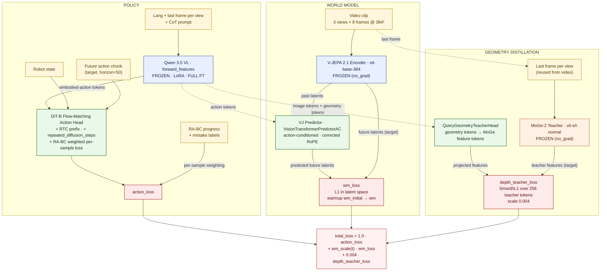
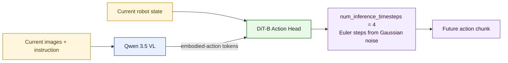

# VLA-JEPA Architecture

This document tracks the active training and inference paths in [`VLA_JEPA.py`](/home/mehul/work/vjepa/VLA-JEPA/starVLA/model/framework/VLA_JEPA.py) under the canonical A100×8 production config in [`vlajepa_robot_ft_canonical_full_a100x8_qwen_full_zero3_moge_vits.yaml`](/home/mehul/work/vjepa/VLA-JEPA/scripts/config/vlajepa_robot_ft_canonical_full_a100x8_qwen_full_zero3_moge_vits.yaml). The companion SVG is [`assets/vla_jepa_architecture_research.svg`](/home/mehul/work/vjepa/VLA-JEPA/assets/vla_jepa_architecture_research.svg).

## Executive Summary

The model has three trainable heads on top of frozen perceptual backbones, and three losses combined into a single objective.

- **Frozen perception**: Qwen 3.5 VL (frozen on small-scale configs, full-FT or LoRA on canonical), V-JEPA 2.1 encoder (always frozen), MoGe-2 teacher (frozen, optional).
- **Trainable heads**: V-JEPA predictor (latent world model), QueryGeometryTeacherHead (MoGe feature distillation), GR00T DiT-B flow-matching action head.
- **Joint objective**: `total_loss = action_loss + wm_scale(t) · wm_loss + 0.004 · depth_teacher_loss`, where `wm_scale(t)` linearly warms up from `wm_initial` to `wm` over `wm_warmup_steps`.

## Training Diagram



## Inference Diagram

Only Qwen 3.5 VL and the DiT action head run at inference. The V-JEPA encoder, V-JEPA predictor, MoGe teacher, and QueryGeometryTeacherHead are training-only.



## Freeze / Train Status (canonical defaults)

| Module | Default state | Notes |
| --- | --- | --- |
| `qwen_vl_interface.model` (Qwen 3.5 VL) | Trainable on canonical full FT, frozen on 5090 lerobot, LoRA optional | Controlled by `trainer.freeze_modules` and `framework.qwenvl.lora.enabled` |
| `vj_encoder` (V-JEPA 2.1) | Frozen | Wrapped in `no_grad` independent of Qwen state so the predictor still trains |
| `vj_predictor` | Trainable | Corrected RoPE; legacy bug retained behind `framework.vj2_model.use_legacy_rope_bug` |
| `action_model` (DiT-B + flow matching) | Trainable | Per-sample loss reduction so RA-BC weights apply |
| `_depth_teacher` (MoGe-2) | Frozen | Loaded outside the trainable state dict |
| `depth_teacher_aux_head` (DirectGeometryHead) | Trainable | Disabled by default; gated by `framework.depth_teacher_aux.enabled` |

## Loss Composition

Computed inside the trainer (not in the model body) so each scale is configurable and the world-model term can warm up:

```text
wm_scale(t) = lerp(wm_initial, wm, min(1, t / wm_warmup_steps))

total_loss = trainer.loss_scale.action          * action_loss
           + wm_scale(t)                        * wm_loss
           + trainer.loss_scale.depth_teacher   * depth_teacher_loss
```

Canonical defaults: `action = 1.0`, `wm_initial = 0.3`, `wm = 0.1`, `wm_warmup_steps = 2000`, `depth_teacher = 0.004`.

## Main Tensor Shapes

- Video input: `B × V × T × C × H × W` with `V = 3`, `T = 8`, `H = W = 384`.
- Action target: `action_horizon = 50`, `future_action_window_size = 49`.
- Action token spans: `num_action_tokens_per_timestep = 8`.
- Embodied-action token spans: `num_embodied_action_tokens_per_instruction = 32`.
- Action-head inference: `num_inference_timesteps = 4` Euler steps.

## Source Pointers

- Framework: [`starVLA/model/framework/VLA_JEPA.py`](/home/mehul/work/vjepa/VLA-JEPA/starVLA/model/framework/VLA_JEPA.py)
- Predictor: [`starVLA/model/modules/world_model/vj2_predictor.py`](/home/mehul/work/vjepa/VLA-JEPA/starVLA/model/modules/world_model/vj2_predictor.py)
- Action head: [`starVLA/model/modules/action_model/GR00T_ActionHeader.py`](/home/mehul/work/vjepa/VLA-JEPA/starVLA/model/modules/action_model/GR00T_ActionHeader.py)
- RTC training: [`starVLA/model/modules/action_model/rtc_training.py`](/home/mehul/work/vjepa/VLA-JEPA/starVLA/model/modules/action_model/rtc_training.py)
- Geometry teacher: [`starVLA/model/modules/geometry_teacher.py`](/home/mehul/work/vjepa/VLA-JEPA/starVLA/model/modules/geometry_teacher.py)
- Trainer (loss composition + RA-BC): [`starVLA/training/train_starvla.py`](/home/mehul/work/vjepa/VLA-JEPA/starVLA/training/train_starvla.py)
